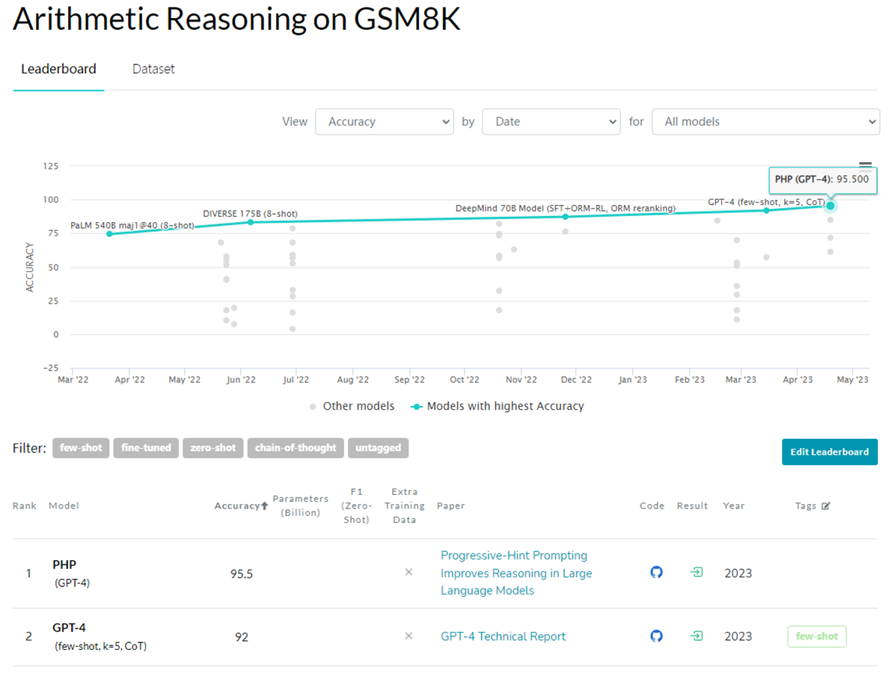

# Progressive-Hint Prompting Improves Reasoning in Large Language Models

[](https://paperswithcode.com/sota/arithmetic-reasoning-on-gsm8k?p=progressive-hint-prompting-improves-reasoning)
[](https://paperswithcode.com/sota/math-word-problem-solving-on-math?p=progressive-hint-prompting-improves-reasoning)
[](https://paperswithcode.com/sota/math-word-problem-solving-on-svamp?p=progressive-hint-prompting-improves-reasoning)
[](https://arxiv.org/abs/2304.09797)


<div align="center">
  
</div>
<p align="center">
  Figure 1: Progressive-Hint Prompting (PHP) interacts with LLM.
</p>

PHP: Simple and Effective for improving LLM reasoning ability.<br>
[Chuanyang Zheng](https://chuanyang-zheng.github.io/), [Zhengying Liu](https://scholar.google.com/citations?user=DFme0joAAAAJ&hl=fr), [Enze Xie](https://xieenze.github.io/), [Zhenguo Li](https://www.ee.columbia.edu/~zgli/) and [Yu Li](https://liyu95.com)<br>
[Preprint  Paper](https://arxiv.org/abs/2304.09797)

This repository contains the official Pytorch implementation of code for [PHP](https://arxiv.org/abs/2304.09797).
PHP is a simple, effective and powerful method, as shown in Figure 1. It is can be easily combined with preivious works such as Chain-of-Thought and Self-Consistency, as they are orthogonal.

## News
- [05/11/2023]: We update the code and data of MATH dataset
- [05/02/2023]: We achieve the SOTA performance 53.9% on MATH dataset, which is the currently most challenging reasoning dataset! We will update our paper and the code soon! Thank you for your attention!!!
- [04/25/2023]: We update the dataset!
- [04/21/2023]: We upload the code!

## PaperWithCode Leaderboard

We achieve the SOTA performance on AQuA, SVAMP, GSM8K and MATH dataset, as the shown in [SVAMP Leaderboard](https://paperswithcode.com/sota/math-word-problem-solving-on-svamp), [GSM8K Leaderboard](https://paperswithcode.com/sota/arithmetic-reasoning-on-gsm8k) and [MATH Leaderboard](https://paperswithcode.com/sota/math-word-problem-solving-on-math) (Date: May 05, 2023)
<div align="center">
  
</div>
<p align="center">
  We achieve the SOTA performnce on GSM8K dataset.
</p>
<div align="center">
  
</div>
<p align="center">
  We achieve the SOTA performnce on MATH dataset.
</p>

## Installation
```sh
pip install jsonlines
pip install openai
```

## Usage
The code needs to be configued witt your account' secret key which is available on [website](https://platform.openai.com/account/api-keys). 
Set `openai.api_key` to its value:
```python
import openai
openai.api_key = "sk-..."
```

## Run
We run the main_clean with the following:
```sh
python python main_clean.py --prompt_dir [base prompt] --eng [openAI model] --seed [seed number] --hint [PHP prompt] --dataset [datasetname] --num_test -1 --q1 [ori: standard or CoT, complex: complex CoT] --q2 [ori: standard or CoT, complex: complex CoT] --sample [sample number] --temp [0.0 for greedy, 0.7 for sc]
```
Or, we can just use the file in bash directory:
```sh
bash bash/cot.sh
```

## Result
We Only show Complex CoT with GPT-3.5-Turbo and GPT-4 Here. For more experiments results (such as text-davinci-002 and text-davinci-003), please refer to our [Paper](https://arxiv.org/abs/2304.09797).
<div align="center">
  
</div>
<p align="center">
  Table 8: Progressive-Hint Prompting (PHP) with GPT-3.5-Turbo and GPT-4. PHP works better when the model is more powerful.
</p>

## Citation
```
@article{zheng2023php,
  title={Progressive-Hint Prompting Improves Reasoning in Large Language Models},
  author={Zheng Chuanyang, Liu Zhengying, Xie Enze, Li Zhenguo, Li Yu},
  journal={arXiv preprint arXiv:2304.09797},
  year={2023}
}
```